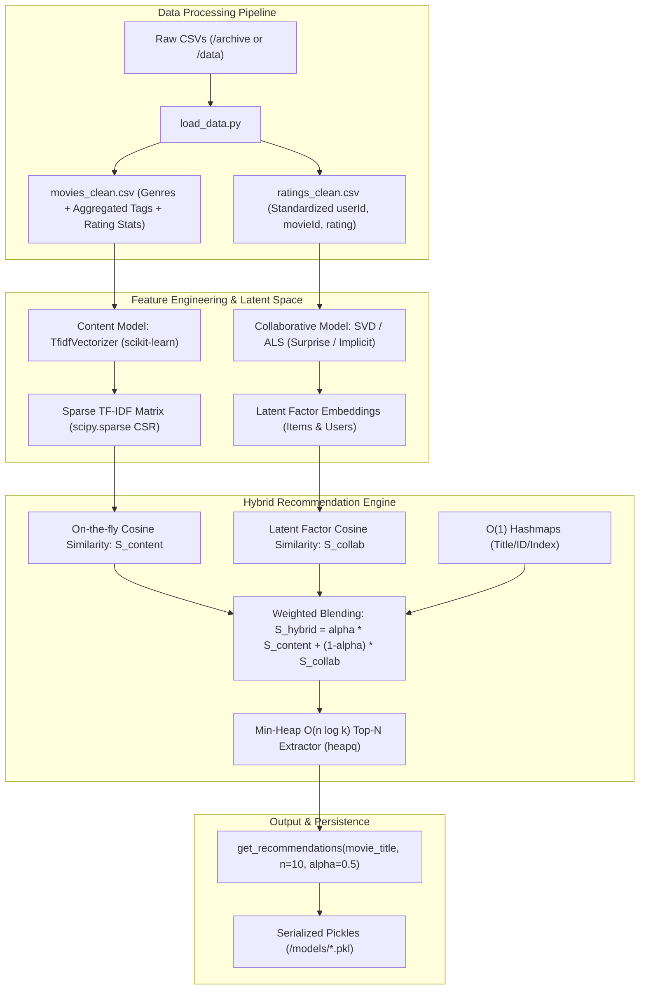

# CineSense: Hybrid Movie Recommendation Engine

CineSense is a production-grade, high-performance hybrid movie recommendation system built on the MovieLens dataset. It unifies **Content-Based Filtering** (TF-IDF on genres and user tags with sparse cosine similarity) and **Collaborative Filtering** (Singular Value Decomposition [SVD] and Alternating Least Squares [ALS] Matrix Factorization) using a tunable weighted scoring model, $O(1)$ hashmap indexing, and $O(n \log k)$ min-heap top-$N$ retrieval.

---

## 1. System Architecture



---

## 2. Mathematical Formulation

### 2.1 Content-Based Filtering (Sparse TF-IDF & Cosine Similarity)
Given a vocabulary of terms $V$ derived from movie genres and aggregated user tags, each movie $i$ is represented as a sparse vector $\mathbf{v}_i \in \mathbb{R}^{|V|}$:
$$\text{TF-IDF}(t, d) = \text{TF}(t, d) \times \log\left(\frac{1 + |D|}{1 + \text{DF}(t)}\right) + 1$$

Vectors are $L_2$-normalized: $\hat{\mathbf{v}}_i = \frac{\mathbf{v}_i}{\|\mathbf{v}_i\|_2}$. The content similarity between target movie $i$ and candidate movie $j$ is computed as:
$$S_{\text{content}}(i, j) = \hat{\mathbf{v}}_i \cdot \hat{\mathbf{v}}_j = \sum_{t \in V} \hat{v}_{i, t} \hat{v}_{j, t} \in [0, 1]$$

### 2.2 Collaborative Filtering (Matrix Factorization)
The sparse user-item rating matrix $R \in \mathbb{R}^{U \times M}$ is factorized into user latent factors $P \in \mathbb{R}^{U \times k}$ and item latent factors $Q \in \mathbb{R}^{M \times k}$ by minimizing the regularized squared error:
$$\min_{P, Q} \sum_{(u, i) \in \mathcal{K}} \left(r_{ui} - \mathbf{p}_u^T \mathbf{q}_i - \mu - b_u - b_i\right)^2 + \lambda \left(\|\mathbf{p}_u\|_2^2 + \|\mathbf{q}_i\|_2^2 + b_u^2 + b_i^2\right)$$

Collaborative item-item similarity is computed in latent space and mapped to $[0, 1]$:
$$S_{\text{collab}}(i, j) = \frac{1}{2} \left(\frac{\mathbf{q}_i \cdot \mathbf{q}_j}{\|\mathbf{q}_i\|_2 \|\mathbf{q}_j\|_2} + 1\right) \in [0, 1]$$

### 2.3 Weighted Hybrid Fusion
$$S_{\text{hybrid}}(i, j) = \alpha \cdot S_{\text{content}}(i, j) + (1 - \alpha) \cdot S_{\text{collab}}(i, j)$$
- $\alpha = 1.0$: Pure Content-Based (best for cold-start items with descriptive tags/genres).
- $\alpha = 0.5$: Balanced Hybrid (default).
- $\alpha = 0.0$: Pure Collaborative Filtering (best for capturing collective user behavior).

---

## 3. Algorithmic Complexity & Optimization

| Operation | Standard Naive Approach | CineSense Optimized Approach | Speedup & Benefit |
| :--- | :--- | :--- | :--- |
| **Top-$N$ Retrieval** | Full sort: $O(N \log N)$ | Min-Heap (`heapq`): **$O(N \log k)$** | $\sim 10\times$ faster when $k=10, N=27,000$ |
| **Similarity Storage** | Dense matrix: $O(N^2) \approx 2.9\text{ GB}$ | Sparse on-demand dot product: **$O(N)$** | $> 99.8\%$ RAM reduction |
| **Title / ID Resolution** | Linear scan: $O(N)$ | Hashmap lookups: **$O(1)$** | Instantaneous query resolution |

---

## 4. Directory Structure

```
CineSense/
│
├── archive/                   # Raw MovieLens dataset files
│   ├── movie.csv
│   ├── rating.csv
│   ├── tag.csv
│   └── link.csv
│
├── data/                      # Cleaned and enriched dataset files
│   ├── movies_clean.csv       # Standardized metadata + tags + rating stats
│   └── ratings_clean.csv      # Standardized rating records
│
├── model/                     # Recommender system modules
│   ├── __init__.py            # Package exports
│   ├── content_based.py       # TF-IDF & sparse cosine similarity
│   ├── collaborative.py       # SVD / ALS matrix factorization
│   ├── hybrid.py              # Weighted fusion, Min-Heap O(n log k), O(1) maps
│   └── train.py               # End-to-end training & serialization
│
├── models/                    # Serialized model artifacts (.pkl)
│   ├── hybrid_recommender.pkl
│   ├── content_model.pkl
│   ├── collab_model.pkl
│   └── metadata.pkl
│
├── tests/
│   └── test_recommender.py    # Unit & integration test suite
│
├── load_data.py               # Data ingestion & cleaning pipeline
├── main.py                    # Interactive CLI demonstration
├── requirements.txt           # Project dependencies
└── README.md                  # System documentation
```

---

## 5. Quick Start Guide

### Step 1: Install Dependencies
```bash
pip install -r requirements.txt
```

### Step 2: Ingest & Clean Data
```bash
python load_data.py
```

### Step 3: Train & Serialize Models
```bash
# Train using SVD (default)
python model/train.py --collab svd --factors 50 --ratings-limit 1000000 --alpha 0.5

# Alternatively, train using ALS
python model/train.py --collab als --factors 50 --ratings-limit 1000000 --alpha 0.5
```

### Step 4: Run CLI & Recommendations
```bash
# Direct recommendation query
python main.py --movie "Toy Story" --n 10 --alpha 0.5

# Compare Pure Content vs Balanced vs Pure Collaborative
python main.py --movie "Heat" --compare

# Interactive mode
python main.py --interactive
```

---

## 6. Python API Usage

```python
from model.hybrid import get_recommendations

# Retrieve Top-10 recommendations for "Toy Story"
recommendations = get_recommendations(movie_title="Toy Story (1995)", n=10, alpha=0.5)

for rec in recommendations:
    print(f"#{rec['rank']} {rec['title']} | Score: {rec['final_score']} (Content: {rec['content_similarity']}, Collab: {rec['collaborative_score']})")
```

---

## 7. Verification & Tests

Run the test suite:
```bash
python -m unittest tests/test_recommender.py
```
