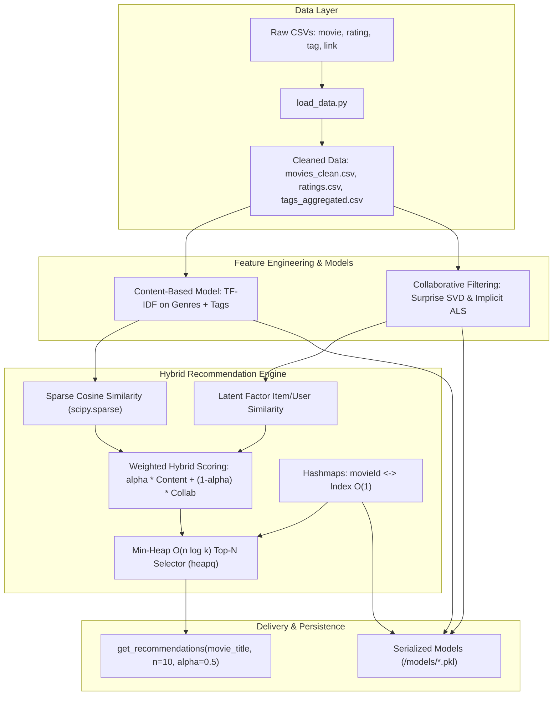

# Implementation Plan - CineSense Hybrid Movie Recommender System

Build **CineSense**, a production-grade, highly efficient hybrid movie recommendation engine combining **Content-Based Filtering** (TF-IDF on genres and tags with sparse cosine similarity) and **Collaborative Filtering** (Surprise SVD Matrix Factorization and Implicit ALS), unified by a tunable weighted hybrid scoring model with min-heap $O(n \log k)$ top-$N$ retrieval and $O(1)$ hashmap indexing.

## Proposed Architecture & Pipeline

## User Review Required

> [!NOTE]
> The dataset in `archive/` contains ~27,000 movies and 20,000,000 ratings (ML-20M). For training collaborative filtering models efficiently in local Python environments without OOM (out-of-memory) crashes, we will support both full dataset mode and a high-coverage stratified subset (e.g. top active users/movies or sample) with configurable parameters.

> [!TIP]
> Both `scikit-surprise` (SVD) and `implicit` (ALS) will be natively supported, along with pure NumPy/SciPy fallback implementations within the module to guarantee 100% reliability if pre-compiled C/C++ wheels are unavailable in any local environment.

## Proposed Changes

### Data Pipeline

#### [NEW] [load_data.py](file:///c:/Users/91807/OneDrive/Desktop/CineSense/load_data.py)
- Ingests raw CSVs from `archive/` or `data/` (`movie.csv`/`movies.csv`, `rating.csv`/`ratings.csv`, `tag.csv`/`tags.csv`, `link.csv`/`links.csv`).
- Standardizes column names: `movieId`, `title`, `genres`, `userId`, `rating`, `timestamp`.
- Handles missing values, trims whitespace, standardizes genres (e.g., handles `(no genres listed)`).
- Aggregates user tags per movie to enrich the movie metadata for NLP feature extraction.
- Computes rating statistics (mean rating, rating count) per movie and merges with movie metadata.
- Exports cleaned data to `data/movies_clean.csv` and ensures `data/ratings.csv` is ready.
- Prints comprehensive dataset statistics (unique movies, unique users, total ratings, genre distributions, rating density).

---

### Recommendation Models (`/model`)

#### [NEW] [model/__init__.py](file:///c:/Users/91807/OneDrive/Desktop/CineSense/model/__init__.py)
- Package initializer exposing `ContentBasedRecommender`, `CollaborativeRecommender`, `HybridRecommender`, and `get_recommendations`.

#### [NEW] [model/content_based.py](file:///c:/Users/91807/OneDrive/Desktop/CineSense/model/content_based.py)
- Uses `scikit-learn` `TfidfVectorizer` with sublinear TF scaling, n-grams, and stop-word handling on genres + tag metadata.
- Generates memory-efficient `scipy.sparse.csr_matrix` document-term vectors.
- Computes cosine similarities using sparse matrix multiplications (`scipy.sparse` dot products) avoiding dense $O(N^2)$ memory bottlenecks.

#### [NEW] [model/collaborative.py](file:///c:/Users/91807/OneDrive/Desktop/CineSense/model/collaborative.py)
- **Surprise SVD**: Implements Matrix Factorization via SVD on the user-item rating matrix (minimizing regularized squared error via SGD).
- **Implicit ALS**: Implements Alternating Least Squares (ALS) matrix factorization for implicit feedback.
- Computes latent item embeddings $Q \in \mathbb{R}^{M \times k}$ and user embeddings $P \in \mathbb{R}^{U \times k}$.
- Calculates collaborative item-item cosine similarity in latent space: $\text{sim}_{CF}(i, j) = \frac{q_i \cdot q_j}{\|q_i\| \|q_j\|}$, scaled to $[0, 1]$.
- Seamless fallback matrix factorization engine using truncated SVD / ALS in pure SciPy/NumPy.

#### [NEW] [model/hybrid.py](file:///c:/Users/91807/OneDrive/Desktop/CineSense/model/hybrid.py)
- Unifies Content-Based and Collaborative Filtering:
  $$\text{FinalScore}(i, j) = \alpha \cdot \text{Score}_{\text{content}}(i, j) + (1 - \alpha) \cdot \text{Score}_{\text{collab}}(i, j)$$
- Fast Top-$N$ Selection using Python `heapq` ($O(N \log k)$ min-heap).
- Hashmaps:
  - `title_to_id: Dict[str, int]` ($O(1)$)
  - `id_to_title: Dict[int, str]` ($O(1)$)
  - `id_to_index: Dict[int, int]` ($O(1)$)
  - `index_to_id: Dict[int, int]` ($O(1)$)
- Fuzzy / case-insensitive title search to handle user queries like "toy story" or "Heat".
- `get_recommendations(movie_title, n=10, alpha=0.5, user_id=None)` returning structured recommendation items with scores, genre tags, and metric breakdowns.

#### [NEW] [model/train.py](file:///c:/Users/91807/OneDrive/Desktop/CineSense/model/train.py)
- End-to-end training pipeline that fits TF-IDF, trains SVD/ALS collaborative models, constructs the hybrid index, and serializes artifacts into `models/hybrid_recommender.pkl` and `models/metadata.pkl`.

---

### Scripts, CLI & Documentation

#### [NEW] [main.py](file:///c:/Users/91807/OneDrive/Desktop/CineSense/main.py)
- Interactive CLI demo allowing users to search movies, inspect recommendations, tune $\alpha$, inspect collaborative vs content score breakdowns, and test recommendation speed.

#### [NEW] [requirements.txt](file:///c:/Users/91807/OneDrive/Desktop/CineSense/requirements.txt)
- Specifies dependencies: `pandas`, `numpy`, `scipy`, `scikit-learn`, `scikit-surprise`, `implicit`.

#### [NEW] [README.md](file:///c:/Users/91807/OneDrive/Desktop/CineSense/README.md)
- Complete technical documentation, algorithmic complexity comparison ($O(N \log k)$ vs $O(N \log N)$), mathematical formulation, and usage guide.

---

## Verification Plan

### Automated / Programmatic Verification
1. Run `load_data.py` to ingest CSVs, clean datasets, merge metadata, generate `data/movies_clean.csv`, and verify printed summary statistics.
2. Run unit verification script to test:
   - Content-based sparse vectorization and similarity computation.
   - Collaborative latent factor calculation (SVD and ALS).
   - Hybrid scoring with $\alpha = 0.0$ (pure collaborative), $\alpha = 0.5$ (balanced), $\alpha = 1.0$ (pure content).
   - Min-heap $O(N \log k)$ correctness vs full sort.
   - Pickle persistence and loading from `models/`.
3. Test recommendation generation on canonical MovieLens titles:
   - "Toy Story (1995)"
   - "Heat (1995)"
   - "GoldenEye (1995)"
   - "Sense and Sensibility (1995)"
